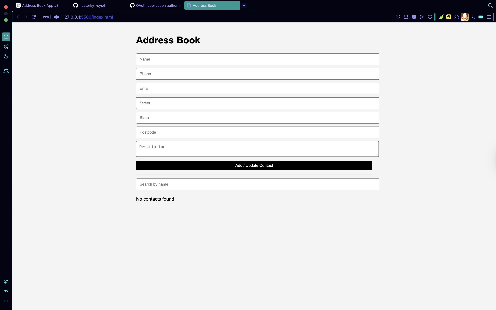
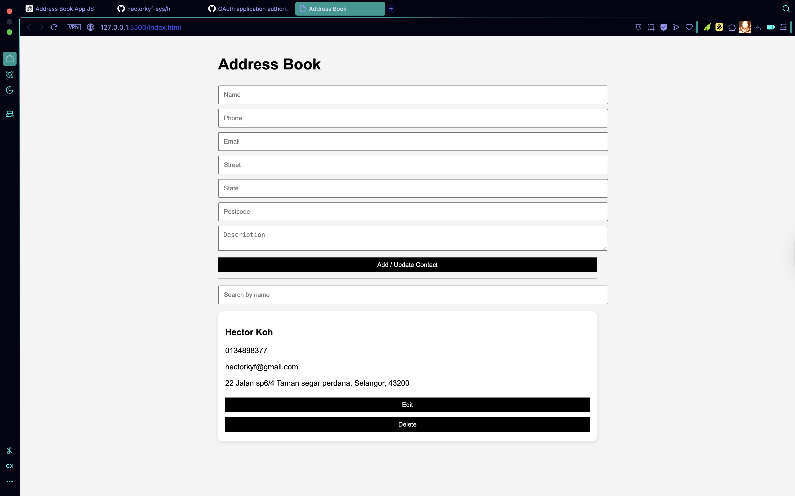

# Address Book Application

A simple Address Book web application built using **Vanilla JavaScript, HTML, and CSS**.  
All data is stored in memory and persisted using **LocalStorage** (no backend required).

---

## Features

- Add new contact
- View all contacts
- Search contact by name
- Edit existing contact
- Delete contact
- Persistent data storage using LocalStorage

---

## Tech Stack

- HTML
- CSS
- JavaScript (Vanilla JS)

---

## How to Run the Project

1. Download or clone the repository
2. Open the project folder in **VS Code**
3. Install the **Live Server** extension
4. Right-click `index.html`
5. Click **Open with Live Server**

---

## Project Structure

address-book/
│
├── index.html
├── style.css
├── script.js
└── README.md

---

## Data Storage

This project uses **browser LocalStorage** to store contacts.  
This ensures data remains available even after refreshing the page.

---

## Screenshots

---

## Author

Hector Koh
